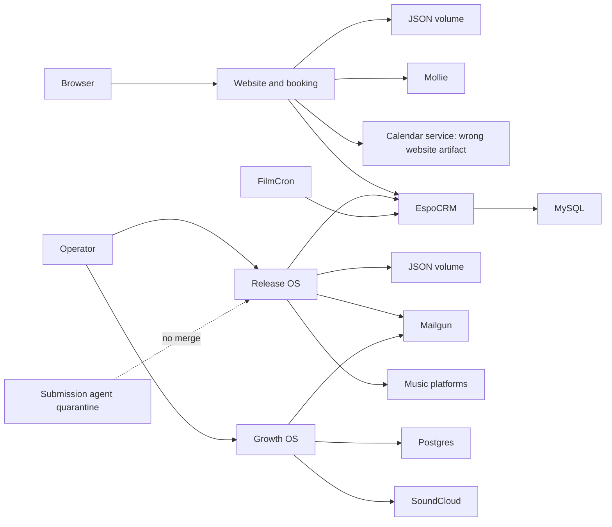

# MarcsMusic modernization baseline

- Status: proposed
- Date: 2026-07-10
- Repository: `ancproggrams/marcsmusic-site`
- Baseline commit: `77303d90cb4d3e5a21b934dd8db4324c9233b954`

This document freezes the evidence and delivery boundaries before runtime changes. It authorizes no production deployment, data migration, token rotation, domain change, payment, email, upload, form submission, or platform publication. `AUTO_SUBMIT_ENABLED` remains `false`.

## Verified baseline

- Local `HEAD`, fetched `origin/main`, and GitHub `main` resolve to the baseline commit.
- Root `npm test` passes, but performs syntax checks only.
- Release OS clean install and verify pass: 37 tests.
- Growth OS clean install, lint, typecheck, 15 tests, and production build pass.
- Submission-agent forensic pin `aa4f04b850d1d0960bf46d068b0afef479cf0e92`: tests pass, but formatting, typecheck, and build fail.
- PR #2 has since moved eight commits beyond that pin. The pin is an immutable migration input, not the current PR head.
- No container runtime is available locally, so submission-agent Docker build and health smoke remain unverified.

## GitHub governance

| Control | Baseline |
|---|---|
| Default branch | `main` at the baseline commit |
| Branch protection / rulesets | None |
| Normal CI checks on main | None; Railway deployment statuses only |
| Workflows | No committed `.github/workflows` |
| Ownership | Repository owner exists; service owners and `CODEOWNERS` are absent |
| PR #1 | Draft, two files, no checks/reviews, based on an old snapshot |
| PR #2 | Conflicting moving target, over 1,400 files, no checks/reviews |

## Railway production inventory

Operational owners, tested rollback procedures, backup policy, RPO, and RTO are unknown unless noted.

| Service | Source and root | State | Public and health | Rollback evidence |
|---|---|---|---|---|
| `marcsmusic-site` | repo `main@77303d90`, `/`, `/railway.json` | `/data` volume | public; `/api/health` only | latest artifact redeploy only |
| `marcsmusic-calendar` | **same website source/root/config** | `/data` volume | public; website health | latest artifact redeploy only |
| `marcsmusic-release-os` | repo `main@417021d2`, `services/release-os` | `/data` volume | public; `/health` only | latest artifact redeploy only |
| `marcsmusic-crm` | repo `main@c7321b20`, `deploy/espocrm` | MySQL | public; `/` probe | latest artifact redeploy only |
| `film-director-search-cron` | repo `main@3287863a`, film cron config | none | every five minutes | latest artifact redeploy only |
| `music-submission-agent` | no repo, branch, or SHA | `/data` volume | public; `/health` only | untraceable artifact |
| `radio-outreach-cron` | no repo, branch, or SHA | none | five-minute command includes `--send` | untraceable artifact |
| `dj-finder-cron` | no repo, branch, or SHA | `/data` volume | 15-minute schedule/loop | untraceable artifact |
| MySQL | image deployment | database volume | internal; no healthcheck | no restore proof |
| `soundcloud-growth-os` | repo `main@77303d90`, `soundcloud-growth-os` | Postgres dependency | public; `/api/health` only | forward migrations only |
| Postgres | image deployment | database volume | internal; no healthcheck | no restore proof |

All observed services use one replica. The calendar service does not run `deploy/radicale`; it runs the website application. No observed app exposes a separate `/readyz`.

## Risk register

| ID | Severity | Broken invariant | Exit gate | Owner |
|---|---|---|---|---|
| R01 | Critical | Repository files are publicly served | Explicit public allowlist and deny regression tests | Website TBD |
| R02 | Critical | Release/Growth control planes lack general identity | Default-deny auth, RBAC, tenant and service-auth tests | Security TBD |
| R03 | Critical | Booking shows slots when CalDAV is unavailable | Fail-closed UI/API and functional readiness | Booking TBD |
| R04 | Critical | Late payment can reopen a cancelled booking | Versioned state machine and concurrency tests | Booking TBD |
| R05 | High | JSON state cannot survive replicas or partial failure | PostgreSQL reconciliation and cutover | Data TBD |
| R06 | Critical | Growth OS uses a global latest token | Tenant/artist context on every query and job | Growth TBD |
| R07 | High | OAuth tokens are plaintext and refresh can race | Versioned encryption and per-account CAS/lease | Security TBD |
| R08 | High | Release upload can escape storage or exhaust memory | Server IDs, containment, streaming and limits | Release TBD |
| R09 | High | Retries can duplicate external effects | Inbox/outbox, unique keys and reconciliation | Platform TBD |
| R10 | High | CRM cron repeats conflicts and full imports | Stable source ID, upsert and checkpoints | CRM jobs TBD |
| R11 | High | Health is green with broken dependencies | Separate liveness and bounded readiness | SRE TBD |
| R12 | Critical | Railway source/root/SHA can drift | Source-connected deployment and post-deploy smoke | Platform TBD |
| R13 | High | PII lacks lifecycle and minimization | Classification, retention, DSAR and suppression | Privacy TBD |
| R14 | High | Git media/local volumes block scale and recovery | Object storage, immutable keys and restore tests | Media TBD |
| R15 | High | Tests/CI give false confidence | Path-aware build/test/security gates | Quality TBD |

Critical risks block production activation unless an owner, expiry, and written risk acceptance exist.

## Current dependency graph



## Target modular monorepo

```text
apps/
  website/
    public/
    src/modules/{booking,payments,newsletter,tracks}/
    src/platform/{auth,db,jobs,observability}/
    tests/{unit,integration,contract,concurrency}/
  release-os/
    src/modules/{artists,releases,publication,campaigns,assets}/
    src/platform/{auth,db,jobs,object-storage,observability}/
  growth-os/
    src/features/{identity,soundcloud,track-sync,reporting,outreach}/
    src/platform/{auth,db,jobs,token-vault,observability}/
jobs/film-director-search/
deploy/{radicale,espocrm}/
docs/{architecture,runbooks,privacy,slo}/
tests/system/
.github/workflows/
```

No deployment unit is added by a directory move. Shared packages are extracted only after two consumers demonstrate stable shared semantics. Domain code imports no HTTP, filesystem, ORM, or provider implementation.

## Delivery sequence and rollback

1. **Containment:** public-file boundary, fail-closed readiness, closed control planes, safe asset IO, and CI. Revert each PR independently; uncertain booking remains disabled.
2. **Additive foundation:** PostgreSQL schemas, identity, inbox/outbox/jobs, and object storage behind flags. Old releases ignore additive schema.
3. **Identity cutover:** OIDC, sessions, RBAC, tenants, CSRF, and service grants. Rollback closes control planes; it never restores anonymous access.
4. **Booking cutover:** state machine, overlap constraint, Mollie inbox, CRM/CalDAV outbox, JSON reconciliation. Rollback after new writes requires database restore/reconciliation, never stale JSON.
5. **Release/media cutover:** PostgreSQL metadata and streamed object storage. Legacy objects remain immutable until checksums and downloads verify.
6. **Growth cutover:** tenant ownership, encrypted token vault, refresh leases, and durable jobs. Production token rotation needs separate approval.
7. **Operations/cleanup:** CRM checkpoints, SLOs, alerts, backup/restore drills, then retention-approved legacy removal.

Every PR states goal, non-goals, relevant ADR, tests, migration/rollback, Railway/security/privacy impact, before/after evidence, and remaining risk. Production deployment always requires explicit human approval.
