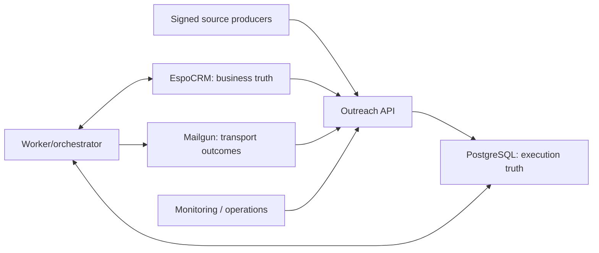

# MarcsMusic outreach — production engineering audit

**Audit date:** 15 July 2026  
**Scope:** the repository-wide outreach path, with detailed review of `services/outreach-worker`, the EspoCRM Railway runtime, the source-ingestion boundary and every direct Mailgun call site found in the repository.  
**Assessment basis:** Clean Code, Clean Architecture, DDD, DDIA, Google SRE, Release It!, Continuous Delivery, OWASP, Zero Trust, ISO/IEC 27001:2022, ISO/IEC 27701:2025 and NIS2-oriented control design.  
**Important boundary:** this is an engineering assessment of code and repository evidence. It is not ISO certification, a Statement of Applicability, a legal opinion, a DPIA or proof that an operational control works in production.

## 1. Executive summary

### Decision

**Production sending is NO-GO at the time of this audit.** The central outreach worker is materially safer than the pre-existing direct send paths, but the repository and currently available evidence do not yet satisfy the documented release gates. Sending must remain fail-closed with `OUTREACH_KILL_SWITCH=true` and `OUTREACH_SEND_ENABLED=false` until all blocker evidence is approved.

**Working-tree remediation status:** F-04 through F-09, F-11 and F-14 through F-18 now have substantive source remediations and regression evidence; F-19 has a pinned quality/security CI definition; F-20 has one executable campaign-terminal-state owner; and F-21 through F-24 harden the CRM projection, public-release proof, unique-create race and managed-record integrity boundaries. This is source evidence, not retained production evidence: the workflow has not yet been made a required protected check, artifact signing/container provenance is incomplete, external provider/Railway/restore tests remain open, and no production key-rotation or restore-key drill has occurred. These changes therefore do **not** alter the NO-GO decision or authorize a deployment.

The chosen architecture is directionally correct: a modular monolith is more appropriate than premature microservices, EspoCRM owns business state, PostgreSQL owns execution state, and Mailgun is treated as a transport rather than a source of contact permission. Durable inboxes, unique idempotency keys, leases, deterministic message IDs, suppression fences and a terminal `delivery_unknown` state are strong safety choices. The architecture should be retained and hardened, not split into microservices.

The principal risks are operational proof, not syntax:

1. required security, restored-state, provider-webhook, least-privilege and privacy evidence is still an open release gate;
2. EspoCRM is deliberately deployed as one volume-bound replica and therefore remains a production availability bottleneck;
3. privacy retention, deletion and data-subject rights remain future operating controls;
4. durable cross-replica telemetry/tracing, named on-call and measured SLO evidence are not present;
5. legacy direct-send routes and credentials remain a deliberate configuration bypass risk until deleted;
6. the implemented keyring still needs approved escrow and a restored-state rotation drill;
7. million-record CRM/soak capacity, Mailgun contracts and restored Railway behavior remain unproven outside local tests.

### P0 defects remediated during this audit

- Both historical direct-send implementations now require the exact string `LEGACY_OUTREACH_SEND_ENABLED=true` before body parsing, attachments, counters or provider I/O. Missing, false, mixed-case and invalid values fail closed. The SoundCloud route enforces this at `soundcloud-growth-os/src/app/api/outreach/email/route.ts:26-39`; release-os has the same domain policy at `services/release-os/src/domain/legacy-outreach-send-policy.mjs:1-19` plus a provider-level second gate at `services/release-os/src/infrastructure/mailgun/mailgun-client.mjs:23-51`.
- Inbound reply parsing now prefers Mailgun `stripped-text`, removes quoted original messages and URL-only unsubscribe footers, while preserving a real newly authored opt-out. See `services/outreach-worker/src/domain/reply-classifier.mjs:15-53` and `services/outreach-worker/src/application/event-service.mjs:168-178`.
- A failed event work item now transitions its linked encrypted inbox row to the same retry/dead-letter state inside the fenced work transaction; `attempts`, backoff and error code stay aligned (`services/outreach-worker/src/infrastructure/outreach-repository.mjs:161-185`).
- The compliance note now identifies the current ISO/IEC 27701:2025 edition rather than relying on the withdrawn 2019 edition.

These fixes remove immediate bypass and false-opt-out defects. They do not make the system production-ready.

### Scores

| Dimension | Score | Interpretation |
| --- | ---: | --- |
| Maintainability | 70/100 | terminal states now have one tested owner and lifecycle invariants are clearer, but several 500–1,400 line hotspots remain |
| Scalability | 60/100 | keyset traversal, fenced reconciliation and priority lanes are implemented; daily O(N) audits and the CRM singleton still bound scale |
| Reliability | 77/100 | leases, timeouts, ingress readiness, shutdown and immediate circuit controls are now bounded; external failure evidence remains |
| Security | 74/100 | versioned AEAD keys and pinned scan/SBOM definitions exist; access, escrow, CI enforcement and release evidence are unproven |
| Architecture maturity | 78/100 | appropriate modular monolith, fenced workflows and one tested campaign-state owner; dual-store convergence needs stronger contracts |
| Operational maturity | 61/100 | runbook and CI evidence production improved; retained monitoring/restore/incident evidence is still absent |
| Engineering quality | 80/100 | clean installs and repository-wide checks are defined and green locally; protected provenance is external work |
| Testing maturity | 82/100 | 163 worker, 62 release-os and 26 SoundCloud checks pass; live provider/restore evidence is missing |
| Regression confidence | 82/100 | strong local, adversarial, load and PostgreSQL protection; real Railway, EspoCRM and Mailgun boundaries remain unproven |
| AI-code risk | 34/100 | **higher is worse**; duplicated state and several speculative gaps are removed, but large control surfaces remain |
| Overall production readiness | 58/100 | materially safer source baseline for isolated staging with sending disabled; not approved for production sending |

No defensible outage probability percentage can be derived from source code alone. The outage indicators remain **high** because of the single EspoCRM replica, missing durable telemetry and unproven restore objectives, even though lock waits and ingress readiness are now bounded in code. The harmful-send indicator is **medium** while both switches are off and **high** if they are enabled before the release gates close.

## 2. Detailed findings

### F-01 — Mandatory production evidence is still open

- **Severity:** Blocker
- **Impacted files:** `docs/outreach/railway-runbook.md:36-58`, `docs/outreach/compliance-evidence.md:47-65`
- **Explanation/root cause:** the runbook correctly makes security scan, SBOM/provenance, restored-state E2E, timed restore, least privilege, webhook contracts and privacy approval mandatory, but every checkbox is still open repository text rather than retained evidence for an exact immutable release.
- **Long-term/production/scaling impact:** enabling sends without these proofs can expose personal data, create unrecoverable state drift or make rollback impossible. Scaling magnifies the affected population and incident cost.
- **Business impact:** an unsafe campaign can damage sender reputation, breach contractual/privacy obligations and halt all outreach.
- **Recommendation:** keep both send controls disabled. Create one immutable release-evidence manifest binding commit, images, SBOM, scans, backup/restore IDs, test outputs, configuration fingerprint and named approvals.
- **Example solution:** a protected CI job produces a signed in-toto/SLSA-style release bundle; the change record references its digest and all runbook gates must resolve to retained evidence before promotion.

### F-02 — Provider and CRM trust configuration is required but not operationally proven

- **Severity:** Blocker
- **Impacted files:** `services/outreach-worker/src/config.mjs:22-32`, `services/outreach-worker/src/config.mjs:131-152`, `docs/outreach/railway-runbook.md:25-34`, `docs/outreach/railway-runbook.md:43-52`
- **Explanation/root cause:** startup validates the presence and shape of secrets, HTTPS and webhook secret maps, but source code cannot prove that the Mailgun signing key is the correct account key, that real webhooks reach the route, or that the EspoCRM API identity has least privilege.
- **Long-term/production/scaling impact:** an incorrect key silently prevents delivery/reply processing; an over-privileged CRM identity expands blast radius; missing lifecycle evidence makes rotation and incident response unreliable.
- **Business impact:** lost replies, sends after an unprocessed complaint, or CRM compromise.
- **Recommendation:** complete signed provider contract tests in isolated staging; record actual EspoCRM role permissions; rotate and escrow independent keys; prove revocation.
- **Example solution:** a staging test creates one allowlisted message, verifies signed accepted/delivered/reply/complaint events, and records only provider IDs and key versions—not secret values.

### F-03 — Legacy direct-send routes remain dangerous when deliberately enabled

- **Severity:** High, mitigated by a default-off gate
- **Impacted files:** `soundcloud-growth-os/src/app/api/outreach/email/route.ts:26-66`, `soundcloud-growth-os/src/lib/outreach/policy.ts:17-24`, `soundcloud-growth-os/src/lib/outreach/policy.ts:63-86`, `services/release-os/src/infrastructure/mailgun/mailgun-client.mjs:48-76`
- **Explanation/root cause:** the old routes bypass EspoCRM/PostgreSQL eligibility, durable suppressions, delivery attempts and uncertainty handling. The SoundCloud allowlist still permits every domain when unset and uses process-memory limits; release-os still blindly retries a Mailgun POST after network/5xx uncertainty. The new exact-true gate prevents accidental use but does not make either route safe.
- **Long-term/production/scaling impact:** one future configuration mistake re-enables duplicate or unauthorized sends; replica restarts reset the old rate limiter.
- **Business impact:** recipient harm and Mailgun/domain reputation damage.
- **Recommendation:** remove Mailgun credentials from both legacy services immediately; migrate any legitimate smoke test to a provider sandbox; delete the routes after one release cycle.
- **Example solution:** keep only `services/outreach-worker/src/infrastructure/mailgun-client.mjs`, whose uncertain POST is terminal and never retried (`:30-70`).

### F-04 — Source-artifact lease ownership was unsafe (resolved in working tree)

**Remediation implemented (2026-07-15):** migration 004 adds owner, version and expiry fencing; ingestion heartbeats the lease and every link/fail/complete mutation requires the exact owner/version. A real PostgreSQL lease-theft test proves the stale worker can no longer mutate or complete the receipt.

- **Severity:** High before remediation; Low residual pending restored/concurrent provider validation
- **Impacted files:** `services/outreach-worker/src/infrastructure/source-ingestion-repository.mjs:4-60`, `services/outreach-worker/src/infrastructure/source-ingestion-repository.mjs:64-84`, `services/outreach-worker/src/application/source-ingestion-service.mjs:46-60`
- **Explanation/root cause:** lease freshness is inferred only from `updated_at`; there is no lease owner, generation token or heartbeat. Processing is sequential and can perform remote validation and CRM writes for hundreds of records. After 15 minutes another request can claim the same artifact while the original continues. Both completions match only `status='processing'`.
- **Long-term/production/scaling impact:** duplicate concurrent CRM mutations, false completion, lost errors and inconsistent evidence links become more likely as artifact size or provider latency grows.
- **Business impact:** duplicate contacts and unreliable provenance can authorize or suppress the wrong record.
- **Recommendation:** add `lease_owner`, `lease_version`, `locked_until`; heartbeat while processing; require the exact lease token on link, fail and complete operations.
- **Example solution:** `UPDATE ... WHERE source_id=$1 AND artifact_id=$2 AND lease_owner=$3 AND lease_version=$4 RETURNING 1`; stop work immediately when heartbeat renewal fails.

### F-05 — Webhook inbox/work failure lifecycle was inconsistent (remediated)

- **Severity:** High before remediation; Low residual
- **Impacted files:** `services/outreach-worker/src/infrastructure/outreach-repository.mjs:48-84`, `services/outreach-worker/src/infrastructure/outreach-repository.mjs:121-185`, `services/outreach-worker/tests/postgres.integration.mjs:329-377`, `services/outreach-worker/migrations/001_initial.sql:8-55`
- **Explanation/root cause:** successful event handlers marked the inbox processed, but work failure changed only the work item. The inbox could stay `pending` forever although `failed` and `dead_letter` existed in its schema.
- **Remediation:** `failWork` now updates the fenced work lease and linked `eventInboxId` in one PostgreSQL transaction, aligns attempts/error/backoff and never overwrites an already processed inbox. A real PostgreSQL regression proves retry then terminal dead letter.
- **Residual impact:** operator replay tooling and a single atomic success transition remain desirable, but the permanent-pending failure/SLO defect is closed.
- **Recommendation:** retain the regression and add controlled dead-letter inspection/replay commands that never bypass signatures, idempotency or current suppression policy.
- **Example solution:** replay creates a new reviewed work attempt referencing the immutable inbox ID and audit decision; it does not edit the original payload or reset attempts silently.

### F-06 — Database calls and advisory locks could wait without a bounded policy (resolved in working tree)

**Remediation implemented (2026-07-15):** pool sessions and transactions now enforce bounded statement, lock and idle-in-transaction timeouts; advisory-lock paths use bounded `pg_try_advisory_*` acquisition and translate timeout/contention into explicit retryable errors. PostgreSQL integration tests exercise both limits.

- **Severity:** High before remediation; Low/Medium residual pending managed-PostgreSQL tuning evidence
- **Impacted files:** `services/outreach-worker/src/infrastructure/postgres.mjs:9-19`, `services/outreach-worker/src/infrastructure/postgres.mjs:22-48`, `services/outreach-worker/src/infrastructure/outreach-repository.mjs:18-45`, `services/outreach-worker/src/infrastructure/outreach-repository.mjs:706-723`
- **Explanation/root cause:** the pool bounds connection acquisition but does not set `statement_timeout`, `lock_timeout`, `idle_in_transaction_session_timeout` or a query timeout. Migrations and send/suppression fences use blocking advisory locks.
- **Long-term/production/scaling impact:** one stuck lock can consume the ten-connection pool, stop webhook durability and block deploys indefinitely. More replicas increase contention.
- **Business impact:** outage, late opt-outs and operator rollback pressure.
- **Recommendation:** set transaction-local timeouts by workload class, use `pg_try_advisory_*` with bounded retry, expose pool waiters and slow queries.
- **Example solution:** at transaction start execute `SET LOCAL lock_timeout='2s'; SET LOCAL statement_timeout='15s'; SET LOCAL idle_in_transaction_session_timeout='20s'` and translate timeout SQLSTATEs to retryable domain errors.

### F-07 — Offset pagination could skip or duplicate changing CRM records (resolved in working tree)

**Remediation implemented (2026-07-15):** Espo iteration now uses a deterministic `(modifiedAt,id)` keyset cursor under a fixed upper watermark. Architecture/unit tests cover equal-timestamp records and prohibit offset traversal on the reconciliation path.

- **Severity:** High before remediation; Low/Medium residual pending production-sized CRM validation
- **Impacted files:** `services/outreach-worker/src/infrastructure/espocrm-client.mjs:49-115`, `services/outreach-worker/src/infrastructure/espocrm-client.mjs:118-151`, `services/outreach-worker/src/application/reconcile-service.mjs:23-46`, `services/outreach-worker/src/application/match-service.mjs:126-170`
- **Explanation/root cause:** list/iterate advance by numeric offset and reconciliation orders only by `modifiedAt`. Concurrent inserts/updates and equal timestamps change page membership. A record can move behind the offset or be repeated.
- **Long-term/production/scaling impact:** reconciliation is not complete at high write rates; an omitted suppression or terminal state can remain stale. Offset queries also get slower as the offset grows.
- **Business impact:** a valid CRM denial may not reach the execution store before a send.
- **Recommendation:** use deterministic keyset pagination on `(modifiedAt,id)` with a fixed upper watermark; require ordered iteration everywhere.
- **Example solution:** query `modifiedAt > cursor.ts OR (modifiedAt = cursor.ts AND id > cursor.id)`, order by both columns and persist the last tuple after a page commits.

### F-08 — Reconciliation lacked singleton ownership and resumability (partially resolved in working tree)

**Remediation implemented (2026-07-15):** migration 006 adds fenced workflow leases and checkpoints. Only one owner may scan, each committed keyset page advances a durable checkpoint, takeover is version-fenced, and the final watermark changes atomically with successful completion. The remaining O(N) full-audit cost still needs measured sharding/rate budgets at million-record scale.

- **Severity:** High before remediation; Medium residual because full reconciliation remains O(N)
- **Impacted files:** `services/outreach-worker/src/application/reconcile-service.mjs:12-55`, `services/outreach-worker/src/worker.mjs:27-55`, `services/outreach-worker/src/worker.mjs:83-106`, `services/outreach-worker/src/infrastructure/outreach-repository.mjs:898-911`
- **Explanation/root cause:** each worker replica schedules reconciliation; dedupe keys reduce duplicate queue rows but there is no durable run lease or unique running workflow. Full reconciliation scans up to ten million rows across five entity types every day.
- **Long-term/production/scaling impact:** replicas can issue overlapping full scans, overload EspoCRM and flood PostgreSQL. A million-user target makes daily whole-dataset traversal expensive and operationally noisy.
- **Business impact:** CRM latency and missed real-time changes during a repair storm.
- **Recommendation:** add a fenced workflow lease, incremental change feed/watermark as the normal path, and partitioned/sharded verification rather than daily global scans.
- **Example solution:** one `workflow_leases` row with owner/version/expiry; full audit processes deterministic ID ranges under a rate budget and resumes from checkpoints.

### F-09 — Worker throughput and backpressure were not sized for millions of records (partially resolved in working tree)

**Remediation implemented (2026-07-15):** matching now builds release/match maps in O(R+M), work claims are isolated into bounded safety-event, projection, matching and maintenance lanes, sending has its own bound, and startup validates the lane budget against the PostgreSQL pool. Load and lane-isolation tests cover the contract.

- **Severity:** High before remediation; Medium residual pending representative downstream/soak evidence
- **Impacted files:** `services/outreach-worker/src/worker.mjs:9-48`, `services/outreach-worker/src/application/match-service.mjs:14-123`, `services/outreach-worker/src/application/match-service.mjs:126-147`, `services/outreach-worker/src/infrastructure/postgres.mjs:9-19`
- **Explanation/root cause:** one process runs one work drain and one send drain serially. Contact matching performs multiple CRM requests and scans up to 500 releases/1,000 matches; `existingMatches.find` inside the release loop is O(R×M). The pool size is hard-coded to ten.
- **Long-term/production/scaling impact:** horizontal workers can claim safely, but no per-kind concurrency, fairness, partitioning or downstream rate budget exists. Expensive matching/reconciliation can starve safety-critical webhook work.
- **Business impact:** stale suppressions and missed campaign windows.
- **Recommendation:** split API and worker process modes in Railway, create priority-isolated worker pools, index matches in a map, and load-test against representative CRM latency.
- **Example solution:** `const byRelease = new Map(existingMatches.map(m => [m.musicReleaseId,m]))` makes matching O(R+M); separately cap concurrency for event, match and projection work.

### F-10 — EspoCRM remains a single volume-bound point of failure

- **Severity:** High
- **Impacted files:** `deploy/espocrm/deployment-contract.json:23-50`, `deploy/espocrm/deployment-contract.json:254-270`, `docs/outreach/railway-runbook.md:76-86`, `docs/outreach/railway-runbook.md:141-149`
- **Explanation/root cause:** the deployment contract fixes `replicas` to one and the Railway volume is singleton-mounted. The contract and runbook now explicitly forbid horizontal scale-out without external shared state and daemon leadership; the topology is consistent but remains non-HA.
- **Long-term/production/scaling impact:** web, daemon and persistent application state share one failure domain. Maintenance or node/volume failure removes CRM availability and readiness.
- **Business impact:** outreach stops and operators lose the business control plane during incidents.
- **Recommendation:** resolve the documentation contradiction and select an explicit HA design: external object storage/shared durable state, stateless web replicas, separately supervised daemon and replicated database—or document the accepted single-node SLO.
- **Example solution:** two stateless web replicas behind Railway, one elected daemon, externalized uploads/config, MySQL 9.4 HA with tested failover, and a restore target proven by timed drills.

### F-11 — Encrypted data had no online key-rotation path (resolved in working tree)

- **Severity:** High before remediation; Low/Medium operational residual
- **Impacted files:** `services/outreach-worker/src/infrastructure/crypto-box.mjs`, `services/outreach-worker/src/config.mjs`, `services/outreach-worker/src/infrastructure/data-reencryption.mjs`, `services/outreach-worker/src/jobs/reencrypt-data.mjs`, `services/outreach-worker/tests/key-rotation.test.mjs`, `services/outreach-worker/tests/postgres.integration.mjs`, `docs/outreach/railway-runbook.md`
- **Original explanation/root cause:** ciphertext stored a key version, but `CryptoBox` accepted exactly one key and rejected every older version. Replacing the key made retained event, copy, response and review payloads unreadable.
- **Long-term/production/scaling impact:** routine rotation, compromise response and restored backups become mutually incompatible.
- **Business impact:** either keys are never rotated or historical evidence is lost during rotation.
- **Remediation/evidence:** `CryptoBox` now encrypts with one active version and decrypts through a bounded historical keyring loaded from `OUTREACH_DATA_DECRYPTION_KEYS_JSON`. Unknown versions fail explicitly. A dry-run-default, advisory-locked, bounded and idempotent `FOR UPDATE SKIP LOCKED` job rotates all four encrypted tables. Unit tests cover old/new/unknown/configuration cases and a real PostgreSQL test proves every payload remains readable and a repeated run updates zero rows.
- **Residual/next control:** execute the runbook in restored isolated staging, retain counts and restore-read evidence, approve recovery-key escrow/revocation, and only remove an old decrypt key in a separate reviewed change. No production rotation was performed by this audit.
- **Example solution now implemented:** one active encrypt key plus `Map<version,Buffer>` decryption and a bounded compare-and-update rewrap job.

### F-12 — Retention, deletion and rights handling are not implemented controls

- **Severity:** High
- **Impacted files:** `docs/outreach/source-of-truth.md:65-69`, `docs/outreach/compliance-evidence.md:22-25`, `docs/outreach/compliance-evidence.md:47-65`, `services/outreach-worker/migrations/001_initial.sql:8-287`
- **Explanation/root cause:** the design deliberately defers retention to a privacy owner. All major execution/evidence tables are append-only and unpartitioned; there is no approved retention metadata, erasure/anonymisation job, legal hold or DSAR workflow.
- **Long-term/production/scaling impact:** storage grows without bound, backups retain personal data indefinitely and rights requests require error-prone manual joins across CRM, PostgreSQL, Mailgun and logs.
- **Business impact:** privacy risk and increasing operational/storage cost.
- **Recommendation:** approve a record-class schedule before production; partition time-series tables; implement deletion/anonymisation with legal holds and immutable execution evidence.
- **Example solution:** monthly partitions for inbox/attempt/outcome tables, scheduled purge using approved durations, and a case-linked erasure report that preserves only non-reversible suppression evidence after legal review.

### F-13 — Metrics are ephemeral and tracing is absent

- **Severity:** High
- **Impacted files:** `services/outreach-worker/src/infrastructure/metrics.mjs:1-30`, `services/outreach-worker/src/interfaces/http/build-server.mjs:124-132`, `services/outreach-worker/src/application/health-service.mjs:13-34`, `docs/outreach/railway-runbook.md:170-205`
- **Explanation/root cause:** counters/gauges live in process maps, reset on restart and are replica-local. HTTP logs record latency, but no histogram is exported. Correlation IDs are not propagated as distributed traces across HTTP, PostgreSQL, EspoCRM and Mailgun.
- **Long-term/production/scaling impact:** restarts erase rates, replicas disagree, tail latency is invisible and incident reconstruction relies on manual IDs.
- **Business impact:** slower detection and longer mean time to recovery.
- **Recommendation:** connect a durable Prometheus/OpenTelemetry pipeline, add bounded-cardinality histograms and propagate trace/correlation context into every work item and provider/CRM call.
- **Example solution:** OTLP spans for ingress → inbox → work → CRM/provider; central metrics store with recording rules for the runbook SLIs and retained alert test evidence.

### F-14 — The safety circuit reacted too slowly and uses a weak outcome window (partially resolved in working tree)

**Remediation implemented (2026-07-15):** a correctly signed complaint and an EspoCRM `Unauthorized Recipient Confirmed` event open the durable circuit in the same PostgreSQL transaction as inbox/work persistence, before HTTP acknowledgement. The slower statistical circuit remains a second layer.

- **Severity:** High before remediation; Medium residual for delayed-cohort statistical evaluation
- **Impacted files:** `services/outreach-worker/src/config.mjs:45-52`, `services/outreach-worker/src/worker.mjs:40-46`, `services/outreach-worker/src/application/health-service.mjs:3-41`
- **Explanation/root cause:** the default evaluation interval is one hour and harmful rate requires at least 20 sent items. A complaint does not immediately open the global circuit. The 24-hour numerator and sent denominator can cover different cohorts because outcomes arrive later.
- **Long-term/production/scaling impact:** a damaging campaign can continue for an hour or the remainder of its cap; delayed events distort the rate.
- **Business impact:** avoidable complaints and sender reputation loss.
- **Recommendation:** complaint and confirmed unauthorized-recipient events open the circuit synchronously; evaluate bounce/failure cohorts by originating send; retain the slower statistical circuit as a second layer.
- **Example solution:** event handler transaction persists complaint/suppression and `safety_state=open` before acknowledging successful processing.

### F-15 — Readiness coupled webhook availability to CRM health (resolved in working tree)

**Remediation implemented (2026-07-15):** `/readyz` now checks only durable PostgreSQL ingress and its required schema. `/capabilities` separately reports sanitized CRM projection, matching and sending availability/reason codes, so a CRM outage does not remove complaint/opt-out ingress.

- **Severity:** High before remediation; Low/Medium residual pending Railway failure-injection evidence
- **Impacted files:** `services/outreach-worker/src/container.mjs:61-67`, `services/outreach-worker/src/interfaces/http/routes/health.mjs:7-15`, `services/outreach-worker/railway.json:9-16`, `docs/outreach/railway-runbook.md:207-218`
- **Explanation/root cause:** `/readyz` requires PostgreSQL, CRM user health and schema probe. Railway uses it for service health. A CRM outage can remove the API from service even though PostgreSQL could still durably accept Mailgun replies, complaints and unsubscribes. The error body always says database unavailable, even when CRM/schema failed.
- **Long-term/production/scaling impact:** downstream failure cascades into ingress loss and provider retry queues; diagnostics send responders to the wrong dependency.
- **Business impact:** delayed suppressions and longer incident recovery.
- **Recommendation:** API readiness should prove ingress durability and local schema; expose CRM/provider capability separately and block worker/send actions through dependency state.
- **Example solution:** `/readyz` returns DB ingress readiness; `/capabilities` reports `crm_projection`, `matching` and `sending`; worker mode has its own readiness contract.

### F-16 — Graceful shutdown had no bounded completion budget (resolved in working tree)

**Remediation implemented (2026-07-15):** shutdown stops every claim lane, aborts CRM/provider/copy requests, drains inside a 25-second hard process deadline, returns safe pre-provider leases and marks provider-started attempts `delivery_unknown`. Repository and runtime tests cover both paths.

- **Severity:** High before remediation; Low/Medium residual pending platform drain evidence
- **Impacted files:** `services/outreach-worker/src/main.mjs:23-31`, `services/outreach-worker/railway.json:9-16`, `services/outreach-worker/src/worker.mjs:60-80`
- **Explanation/root cause:** Railway drains for 30 seconds, while `main` awaits all worker loops with no forced deadline. An in-flight CRM/provider request or large reconciliation can outlive the platform budget and be killed.
- **Long-term/production/scaling impact:** more work kinds and slower dependencies increase forced termination; send attempts become `delivery_unknown`, while non-send work may replay after lease expiry.
- **Business impact:** manual reconciliation load and ambiguous delivery.
- **Recommendation:** stop claiming immediately, propagate abort signals to HTTP clients, set a 25-second shutdown deadline and deliberately relinquish/reclassify leases before exit.
- **Example solution:** race `worker.done` against a shutdown timer; provider POSTs killed after dispatch remain terminal `delivery_unknown`, while safe pre-send work releases its lease.

### F-17 — Daily counters used database timezone while scheduling used Europe/Amsterdam (resolved in working tree)

**Remediation implemented (2026-07-15):** the application computes one explicit `Europe/Amsterdam` business date and UTC day range. Reservations store that date; consume/release operations use the reservation row rather than `CURRENT_DATE`; reports use explicit UTC boundaries and cover 23/25-hour DST days.

- **Severity:** High before remediation; Low residual
- **Impacted files:** `services/outreach-worker/src/worker.mjs:8-9`, `services/outreach-worker/src/worker.mjs:83-104`, `services/outreach-worker/migrations/001_initial.sql:201-220`, `services/outreach-worker/src/infrastructure/outreach-repository.mjs:727-760`, `services/outreach-worker/src/infrastructure/outreach-repository.mjs:962-985`
- **Explanation/root cause:** scheduler/report dates are Europe/Amsterdam but capacity rows and finalisation use `CURRENT_DATE`, which depends on the PostgreSQL session timezone. A reservation created before midnight cannot be reliably consumed/released after midnight because later queries search only today.
- **Long-term/production/scaling impact:** counters leak, limits reset at the wrong local boundary and daily reports disagree during DST/midnight windows.
- **Business impact:** over- or under-sending relative to approved caps and inaccurate management reporting.
- **Recommendation:** calculate an explicit approved business date once, store it on the queue/reservation and always finalize by reservation primary key rather than `CURRENT_DATE`.
- **Example solution:** pass `DateTime.utc().setZone('Europe/Amsterdam').toISODate()` into reservation SQL and query `WHERE send_queue_id=$1` for finalisation.

### F-18 — Regex reply classification performed irreversible outlet/domain actions (resolved in working tree)

**Remediation implemented (2026-07-15):** only an explicit newly authored contact opt-out is applied irreversibly. No-submissions and ambiguous replies stop the sequence in `Needs Attention`, create encrypted durable review work with actor/decision fields, and neither auto-reply nor suppress a contact, outlet or domain.

- **Severity:** High before remediation; Low/Medium residual pending human-review operating evidence
- **Impacted files:** `services/outreach-worker/src/domain/reply-classifier.mjs:1-12`, `services/outreach-worker/src/domain/reply-classifier.mjs:48-79`, `services/outreach-worker/src/application/event-service.mjs:177-215`, `services/outreach-worker/src/application/event-service.mjs:296-327`, `docs/outreach/state-machine.md:100-115`
- **Explanation/root cause:** the first regex match receives a synthetic confidence `0.99`. “Not accepting music” automatically blocks contact, outlet and domain, although the state-machine document says outlet/domain suppression happens “after scope review.” Ambiguous replies also receive an automatic acknowledgement despite being marked for human review.
- **Long-term/production/scaling impact:** natural language, signatures and forwarding create false positives; a single contact can disable an entire domain across campaigns.
- **Business impact:** valid outlets disappear and recipients receive unexpected automated replies.
- **Recommendation:** only explicit contact-level unsubscribe may be irreversibly automated. Put outlet/domain suppression and all ambiguous responses into a review queue with evidence snippet, actor and decision audit.
- **Example solution:** `replyAction('Not Accepting Music')` yields `proposedSuppressionScope='outlet'`; a reviewer-approved command applies it idempotently.

### F-19 — No protected CI/release provenance pipeline was found (partially resolved in working tree)

- **Severity:** High before remediation; Medium/High residual until enforcement and provenance are retained
- **Impacted files:** `.github/workflows/quality.yml`, `.gitignore`, `deploy/espocrm/verify-deployment.sh`, the three Node lockfiles and verification scripts, `docs/outreach/railway-runbook.md`
- **Original explanation/root cause:** local `verify` scripts were useful, but no GitHub Actions, GitLab CI or Jenkins workflow existed in the repository. There was no automated SCA, secret scan, SBOM, image scan, migration compatibility gate or signed artifact provenance.
- **Long-term/production/scaling impact:** quality depends on individual workstations and manual memory; team changes and AI-assisted edits increase regression and supply-chain risk.
- **Business impact:** an unverified commit or vulnerable dependency can reach production without independent evidence.
- **Remediation/evidence:** `.github/workflows/quality.yml` pins Node 24.18.0, GitHub actions by commit SHA and Gitleaks 8.30.1 by archive checksum. It uses locked installs without lifecycle scripts; verifies worker unit/PostgreSQL/load contracts, release-os, SoundCloud lint/type/test/build and EspoCRM static deployment contracts; fails on high/critical production dependency findings; scans current branch history with redaction; and uploads lockfile-derived CycloneDX SBOM artifacts. It contains no deploy command. Local equivalents passed, including zero `npm audit` findings in all three projects.
- **Residual/next control:** make checks required on protected `main`; run the workflow in the remote clean runner; add image scanning, signed image/SBOM attestations and restored-state promotion evidence. A workflow definition is not itself protected provenance and does not close F-01.
- **Example solution remaining:** bind signed image/SBOM/scan digests and exact test run IDs into the immutable release-evidence manifest.

### F-20 — Large hotspots and architecture drift raise ten-year maintenance risk (terminal-state drift resolved)

- **Severity:** Medium/High
- **Impacted files:** `services/outreach-worker/src/infrastructure/outreach-repository.mjs` (1,040 lines), `services/outreach-worker/src/application/legacy-lead-migration.mjs` (796), `services/outreach-worker/src/application/event-service.mjs` (503), `services/outreach-worker/src/application/send-service.mjs` (496), `deploy/espocrm/runtime.php` (1,421), `deploy/espocrm/start-railway.sh` (1,039), `services/outreach-worker/src/domain/copy-policy.mjs:1`, `docs/outreach/state-machine.md:46-62`
- **Explanation/root cause:** repository, orchestration and bootstrap classes accumulate unrelated responsibilities. The domain copy policy imports an infrastructure crypto module, reversing Clean Architecture dependency direction. Terminal state sets differ and `Failed` is documented as terminal but is absent from several code sets.
- **Long-term/production/scaling impact:** changes require broad context, merge conflicts rise, hidden invariants diverge and junior maintainers are likely to patch one state set but miss another.
- **Business impact:** slower delivery and increased regression risk during incidents or team turnover.
- **Partial remediation/evidence:** `src/domain/campaign-state.mjs` is now the only worker owner of valid and terminal campaign statuses. Event, match, send and work services consume it; `Failed` is consistently terminal. An architecture fitness test requires exact equality with the EspoCRM extension metadata and rejects reintroduced local terminal sets.
- **Residual/recommendation:** the 500–1,400 line repository/runtime/bootstrap hotspots and the copy-policy dependency inversion remain. Split them by cohesive capability and move hash primitives to a domain-neutral shared kernel.
- **Example solution:** retain the implemented `campaign-state.mjs`; continue with `InboxRepository`, `WorkQueueRepository`, `SendQueueRepository`, `SuppressionRepository` and `WorkflowRepository` without changing transaction boundaries blindly.

### F-21 — Confirmed deliveries lacked a complete, replay-safe CRM projection (resolved in working tree)

- **Severity:** High before remediation; Medium residual until pinned disposable and restored-staging evidence is retained
- **Impacted files:** `services/outreach-worker/migrations/009_crm_projection.sql`, `services/outreach-worker/src/application/crm-projection-service.mjs`, `services/outreach-worker/src/application/crm-target-projection-service.mjs`, `services/outreach-worker/src/infrastructure/espocrm-client.mjs`, EspoCRM Email/Campaign/TargetList/Opportunity metadata and hooks, `docs/outreach/crm-projection.md`
- **Original explanation/root cause:** provider acceptance and the human-visible CRM receipt were separate best-effort effects. Campaign grouping stopped at a review placeholder because custom MediaContact Target List membership had not been proven. Replays could therefore leave a confirmed send without a standard Email, stable copy versions or exact Campaign membership.
- **Long-term/production/scaling impact:** cross-store drift grows with every provider/CRM outage; reporting becomes unauditable, operators cannot distinguish a missing projection from a missing send, and concurrent recipients can corrupt aggregate counts.
- **Business impact:** inaccurate campaign reporting, duplicate manual remediation and commercial follow-up without dependable provenance.
- **Remediation/evidence:** provider acceptance, a durable projection receipt and deduplicated projection work now commit in one PostgreSQL transaction. Standard Email and immutable OutreachEvent records use deterministic unique keys and persisted receipt/copy data. One real Target List and Campaign per release are database-unique; relation writes are narrowly allow-listed and read-after-write verified. Only a freshly eligible delivered contact is included, and exact counts converge with OCC under concurrent/replayed deliveries. Positive replies converge on one Opportunity without invented revenue; genre/future preferences are provenance linked and deny-safe. The worker unit matrix includes concurrent create, replay, ineligible exclusion and immutable mismatch coverage.
- **Residual/next control:** the pinned disposable EspoCRM/MySQL verifier now retains a 153-request live-HTTP matrix for relation schema, exact entry counts, identity rejection, state hooks, ACL denial, duplicate races and OCC-safe accepted updates. Repeat that same frozen artifact against restored staging. Route B must remain the only sender; a reporting Target List must never implicitly authorize Mass Email.

### F-22 — Release identity and EPK activation could be asserted without verifiable public evidence (resolved in working tree)

- **Severity:** High before remediation; High residual for production content/operating evidence
- **Impacted files:** `src/epk/*`, `services/outreach-worker/src/application/epk-verification-service.mjs`, `services/outreach-worker/src/infrastructure/epk-verification-*.mjs`, MusicRelease metadata and `Hooks/MusicRelease/ActivationIntegrity.php`, `docs/epk.md`
- **Original explanation/root cause:** CRM could mark a release Active from the presence of a private stream or manually entered URL. ISRC was not a database-wide immutable identity and there was no digest-bound comparison between the public EPK and CRM activation fields.
- **Long-term/production/scaling impact:** stale or mismatched assets can be sent at scale, concurrent source revisions can split one recording into multiple identities, and a human-authored status becomes unauditable approval evidence.
- **Business impact:** wrong release assets, broken pitches, rights/contact omissions and reputational harm.
- **Remediation/evidence:** ISRC is canonicalized and globally unique; source revisions use evidence time/digest with bounded OCC conflict handling. A new release starts Unverified. The bounded EPK verifier requires the strict public manifest, rights/contact data, health, HTML/JSON and public assets; it compares every modeled activation field and writes proof only with the fetched CRM version. The server hook independently rejects Active without proof and invalidates/clears proof on every manifest-covered change, moving Active to Paused and Ready to Draft. Unit tests cover SSRF/rebinding, redirects, sizes, content types, timeouts and complete re-verification after an OCC conflict.
- **Residual/next control:** the repository manifest is intentionally example-only. Production remains blocked until an accountable owner supplies and approves real content/rights evidence, the public routes/assets pass the verifier, and pinned EspoCRM API hook behavior is retained as release evidence.

### F-23 — EspoCRM unique-create races returned opaque 500 errors (resolved in working tree)

- **Severity:** High before remediation; Low residual pending restored-staging evidence
- **Impacted files:** `deploy/espocrm/extensions/marcsmusic-outreach/files/custom/Espo/Modules/MarcsMusicOutreach/Services/*`, `services/outreach-worker/src/infrastructure/espocrm-client.mjs`
- **Original explanation/root cause:** the worker's idempotent upsert algorithm correctly reconciles HTTP 409 or an unknown delivery outcome, but EspoCRM 10.0.2 passes MySQL duplicate-key `PDOException` values through as an empty HTTP 500. A pinned concurrent canonical/hyphenated ISRC create, duplicate Target List create and duplicate Campaign create each reproduced the defect while the database correctly retained one row.
- **Long-term/production/scaling impact:** ordinary concurrent replicas poison otherwise safe projection work, retry a permanent conflict as an outage and accumulate dead letters. The rate grows with worker concurrency even though database uniqueness remains intact.
- **Business impact:** sends and source imports can be correctly recorded in one owner while their CRM receipt/reporting projection appears failed and requires unnecessary operator intervention.
- **Remediation/evidence:** entity-scoped record services now translate only MySQL SQLSTATE `23000`, driver code `1062` and explicitly allow-listed table/index identities to a stable, non-sensitive `ConflictSilent` 409 body. Every other database exception is rethrown unchanged. The map covers every entity used through the worker's unique-upsert boundary, while the Email specialization retains EspoCRM's core send lifecycle.
- **Residual/next control:** the final pinned disposable-image verifier now proves the exact 409/body/no-leak and single-row postcondition for all 11 unique service boundaries, including a concurrent canonical/hyphenated ISRC race. Repeat the frozen artifact against restored staging; do not broaden the mapper to arbitrary integrity or database errors.

### F-24 — Clearing a managed projection key bypassed the server hook invariant (resolved in working tree)

- **Severity:** High defense-in-depth integrity defect before remediation; Low residual pending restored-staging evidence
- **Impacted files:** EspoCRM `Hooks/Email/OutreachProjectionIntegrity.php`, `Hooks/Opportunity/OutreachProjectionIntegrity.php`, `Hooks/Campaign/OutreachProjectionIntegrity.php`, `Hooks/TargetList/OutreachProjectionIntegrity.php`
- **Original explanation/root cause:** each hook checked the incoming `outreachProjectionKey` and returned immediately when it was empty before consulting the fetched value. EspoCRM's generic `readOnlyAfterCreate` input filter silently discarded a normal API null update, while the authoritative server hook itself did not protect internal/custom record saves. Such a save could remove the marker used by the remaining immutable/delete guards, and a caller could mistake the successful no-op response for an accepted identity change.
- **Long-term/production/scaling impact:** a customization or future internal job could detach a managed record from its deterministic identity, mutate attributable evidence and create duplicate or orphaned projections that no replay can safely reconcile.
- **Business impact:** campaign counts, sent-email receipts and commercial-interest provenance could be edited or deleted without the audit trail claiming a managed object.
- **Remediation/evidence:** every hook now checks the fetched managed key before the empty-current-key branch and rejects any change, including null/empty. A service-layer input guard runs before EspoCRM's generic field filtering and returns an explicit `403` for null, empty or changed identity input across all 10 guarded service types. Reserved relationship/identity fields also require a valid managed projection key, so an unmanaged record cannot occupy the unique projection graph. The live matrix proves exact API and database identity, version and audit metadata remain unchanged after every rejection.
- **Residual/next control:** repeat the frozen 153-request matrix against restored staging and retain the least-privilege role export plus negative send test; least-privilege roles remain mandatory.

## 3. Architecture report

### Current dependency and ownership model

This is a sensible bounded-context split:

- **Campaign/relationship context:** release, outlet, contact, eligibility and human-visible status in EspoCRM.
- **Execution context:** inbox, queue, lease, attempt, allocation, capacity, circuit and watermark in PostgreSQL.
- **Transport context:** Mailgun accepts a deterministic request and emits signed outcomes; it never grants contact permission.
- **Acquisition context:** signed versioned artifacts carry evidence into the CRM boundary.
- **Governance context:** runbook, release evidence, privacy approvals and incident controls sit outside application code.

### Architecture strengths

- Fail-closed dual deployment switches default to safe values (`services/outreach-worker/src/config.mjs:33-39`).
- Eligibility is deterministic, explicit and denial-oriented (`services/outreach-worker/src/domain/eligibility-policy.mjs:5-30`).
- Incoming payloads are signed, encrypted and deduplicated before work is acknowledged (`services/outreach-worker/src/interfaces/http/routes/espocrm-webhook.mjs:6-39`, `services/outreach-worker/src/interfaces/http/routes/mailgun-webhook.mjs:6-33`).
- Queue uniqueness, deterministic IDs and append-only attempts model crash/replay correctly (`services/outreach-worker/migrations/001_initial.sql:95-183`).
- Mailgun uncertainty is terminal rather than blindly retried (`services/outreach-worker/src/infrastructure/mailgun-client.mjs:30-70`).
- The API has body/part limits, request timeouts, capacity admission and protected request logging (`services/outreach-worker/src/interfaces/http/build-server.mjs:13-42`, `:65-77`, `:96-145`).

### Architecture weaknesses and violations

- Domain → infrastructure dependency in `copy-policy.mjs` breaks inward dependency direction.
- A database transaction cannot span PostgreSQL and EspoCRM. Confirmed delivery now commits a durable idempotent CRM projection receipt/work item with provider acceptance; the remaining risk is measured backlog/convergence and poisoned projection handling, not an assumed synchronous dual write.
- Work dispatch is a large switch; adding a new workflow requires edits across dispatcher, retry semantics, state model and tests.
- Direct provider clients exist in three services. The default-off gates mitigate them but do not remove architectural duplication.
- The source-ingestion HTTP request performs the full remote CRM workflow synchronously rather than durably accepting and asynchronously processing it.
- EspoCRM bootstrap scripts combine install, recovery, attestation, supervision and deployment policy in very large shell/PHP units.

### Coupling and dependency risk

| Boundary | Coupling | Risk | Required control |
| --- | --- | --- | --- |
| worker ↔ EspoCRM | synchronous REST plus optimistic version | high outage/latency coupling | bounded client budgets, local durable commands, projection retry |
| API ↔ PostgreSQL | synchronous durable ingress | deliberate hard dependency | HA, capacity, statement/lock timeouts |
| worker ↔ Mailgun | one irreversible POST | uncertainty/duplicate risk | attempt-before-send, deterministic ID, no uncertain retry |
| EspoCRM ↔ PostgreSQL | eventual projection | state divergence | transactional outbox per owner and convergence SLO |
| source producer ↔ CRM | synchronous batch | lease and partial-progress risk | durable artifact queue with fenced processing |
| Railway volume ↔ EspoCRM | singleton persistence | single point of failure | explicit accepted SLO or externalised HA storage |

### Domain consistency report

- Ubiquitous language is mostly clear: release, outlet, contact, match, suppression, allocation and outcome.
- `campaignStatus`, queue `status`, eligibility status and reply status are correctly distinct. Worker statuses have one domain owner and the EspoCRM server hook consumes an exhaustive versioned transition table, preventing direct API bypass.
- `Failed` is consistently terminal and ambiguous/no-submissions replies create durable human review. Architecture tests require metadata/policy completeness; restored-runtime hook evidence remains a release gate.
- The model is somewhat anemic because decisions live in application services and state is represented as strings in remote CRM records. In JavaScript this is acceptable if the transition policy becomes one pure, exhaustively tested domain module.

## 4. Reliability report

### Verified reliability controls

- `FOR UPDATE SKIP LOCKED` claims support competing consumers.
- Work has lease versions and heartbeats; sends record attempts before provider I/O.
- Retries are bounded and exponential; uncertain delivery is quarantined.
- Suppression is deny-wins and protected by cross-replica advisory fences.
- Source ingestion and reconciliation use owner/version fencing, heartbeat/checkpoints and safe takeover.
- PostgreSQL statements, transactions and advisory-lock acquisition have bounded policies.
- Ingress readiness is separated from CRM/send capability; shutdown has an explicit platform budget.
- Health circuit never auto-closes; operator reset is explicit.
- Runbook defines emergency stop, preservation, recovery and provisional SLOs.

### Outage and operational gaps

| Risk | Likely failure mode | Detection today | Recovery maturity |
| --- | --- | --- | --- |
| EspoCRM/volume failure | API not ready; worker projections/matching stop | readiness/logs | restore objective is provisional |
| PostgreSQL lock/pool saturation | webhook acceptance and all queues stop | readiness and bounded timeout errors | code is bounded; managed-service tuning/capacity is unproven |
| Mailgun uncertainty | send becomes `delivery_unknown` | metric after health evaluation | safe but manual reconciliation |
| CRM reconciliation drift | stale business denial | fixed-watermark keyset audit | locally fenced/resumable; production completeness is unproven |
| source worker lease loss | stale worker stops before CRM mutation | fenced heartbeat error | owner-token recovery is implemented; provider-scale drill remains |
| worker termination | safe replay or terminal uncertain delivery | shutdown/stale-claim signals | 25-second budget exists; Railway behavior is unproven |
| metric reset | invisible rate/backlog discontinuity | none | no durable telemetry store in scope |

### Operational maturity assessment

The runbook is more mature than the deployed evidence. It defines sensible controls and rejects unsupported compliance claims, but the actual operating system—24/7 alert routing, named on-call, dashboards, central immutable logs, restore timings, incident exercises and measured SLOs—is not evidenced. Treat the runbook as a design specification until exercises produce retained results.

## 5. Performance report

### Complexity and bottlenecks

| Path | Complexity | Principal bottleneck | Scaling risk |
| --- | --- | --- | --- |
| contact matching | O(R+M + R log R) locally | repeated CRM requests | improved; downstream latency remains the scale bound |
| release matching | O(C), then C queued contact jobs | full contact scan | high for each release at millions |
| full reconciliation | O(E) across five entity sets | keyset CRM traversal and queue writes | complete/resumable but still a high daily load |
| source artifact | O(A) sequential | SMTP/HTTP validation + CRM writes per record | heartbeat prevents theft; throughput remains bounded |
| queue claim | approximately O(log Q) with partial indexes | DB lock/pool contention | acceptable if tables retained/partitioned |
| daily report | O(events/day + matches/day) | remote scan and in-memory sets | memory grows with unique contacts |
| operational snapshot | several counts/min scans | ever-growing tables | degrades without retention/partitions |

The included load contract is useful but narrow: it covers 10,000 duplicate HTTP replays and 2,000 queue claims (`services/outreach-worker/tests/load-chaos.integration.mjs:16-23`, `:42-118`, `:216-260`). It does not model a million-record CRM, real network latency, long-running reconciliation, Mailgun rate limits or multi-hour soak behavior.

### Performance recommendations

1. production-validate the implemented keyset cursors and add CRM-side selective queries;
2. retain the implemented O(R+M) maps and benchmark representative release/contact cardinalities;
3. tune the implemented priority-isolated worker lanes against measured downstream budgets;
4. partition retained time-series tables and archive approved evidence;
5. size pool and worker concurrency from measured downstream budgets, not a global hard-coded value;
6. run soak, failure-injection and restored-dataset benchmarks before cap expansion.

No pgvector/vector-search code exists in this outreach scope. ANN/HNSW/IVFFlat recommendations would be cargo-cult architecture here and should not be introduced without a real semantic-search requirement and measured recall/latency target.

## 6. Security and privacy report

### Effective controls

- HMAC signatures and replay identities protect EspoCRM, Mailgun and source ingress.
- AES-256-GCM with associated data protects technical payloads at the application layer.
- Privacy hashes use an independent keyed HMAC; config prevents key reuse.
- Unsubscribe GET is confirmation-only and POST performs mutation.
- Request bodies, multipart pieces, headers and in-flight concurrency are bounded.
- Production URLs must use HTTPS; raw secrets are neither documented nor expected in Git.
- Provider tracking is disabled for outgoing Mailgun messages.

### Critical gaps and OWASP/Zero Trust implications

| Gap | Security consequence | Control family |
| --- | --- | --- |
| least-privilege grants unproven | excessive API blast radius | broken access control / Zero Trust |
| old provider credentials/routes retained | bypass of central policy | insecure design / configuration |
| versioned keyring exists but escrow/rotation-drill evidence does not | incomplete recovery-key lifecycle proof | cryptographic failures |
| pinned CI/SCA/secret/SBOM definition exists but is not yet a protected retained run | dependency and build provenance residual | software supply-chain integrity |
| no approved retention/rights jobs | excessive PII and rights failure | privacy by default |
| no durable audit/trace backend | incomplete detection and forensics | security logging/monitoring |
| operator-configured outbound URLs | SSRF if configuration authority is compromised | SSRF / configuration governance |
| no public-edge rate/WAF evidence | authenticated endpoints still absorb parse/signature load | availability/abuse prevention |

The code aligns with parts of ISO/IEC 27001:2022 and ISO/IEC 27701:2025 control design, but management-system clauses require organizational scope, risk treatment, ownership, internal audit, management review and operating evidence. NIS2 applicability and national implementation are legal/governance questions outside this repository. The authoritative limitations are recorded in `docs/outreach/compliance-evidence.md`.

## 7. Testing report

### Coverage assessment

| Test layer | Maturity | Evidence | Gap |
| --- | --- | --- | --- |
| pure domain/unit | strong | eligibility, scheduling, copy, reply, allocation | property/mutation tests absent |
| HTTP/security | strong | invalid signatures, replays, opt-out, malformed payloads | public-edge/WAF behavior absent |
| PostgreSQL integration | strong locally | real schema, leases, concurrency, uncertainty | managed Railway PostgreSQL not proven |
| load/chaos contract | moderate | bounded replay/admission/queue tests | no soak, CRM scale or provider latency |
| EspoCRM extension contract | moderate | schema/runtime validation scripts | restored production-like E2E still a gate |
| provider contract | weak/incomplete | mocked clients and signature fixtures | live isolated Mailgun webhooks missing |
| recovery/rollback | design only | detailed runbook | timed restore evidence missing |
| deployment/supply chain | moderate in working tree | pinned CI, SCA, secret scan, SBOM and static deployment contract | remote required-check enforcement, image scan and signed provenance absent |

During this audit the central worker passed **137/137 unit tests** and **26/26 PostgreSQL/load integration tests**; its latest bounded local run processed 10,000 duplicate webhook requests at about 4,264 requests/second and drained 2,000 queue items at about 3,437 items/second on this workstation. SoundCloud passed lint, type-check, production build and **26/26 tests** after a clean locked install; release-os passed **62/62 tests** after a clean locked install. All three production dependency audits reported zero known vulnerabilities at the audit timestamp, and all three lockfiles produced valid CycloneDX 1.5 SBOMs. These results validate local code and database contracts only; they are not a substitute for a retained remote CI run, restored-state Railway/EspoCRM or live Mailgun provider suites.

### Scores

- Testing maturity: **82/100**
- Regression confidence: **82/100**
- Regression risk: **23/100** (**higher is worse**)

The biggest confidence gap is at system boundaries, not unit logic.

## 8. AI-generated code risk review

No authorship can be proven from source text. The repository nevertheless shows patterns that frequently arise in AI-assisted development:

- very large “enterprise” bootstrap/runtime files with many intertwined safeguards;
- duplicated direct Mailgun clients; the worker's terminal campaign state sets are now centralized;
- documentation that promises a scope-review step the implementation does not perform;
- an infrastructure hash helper imported into a domain policy;
- generous future-scale limits (`10_000_000`) still exceed measured evidence, despite the new keyset/priority-lane design;
- many controls remain encoded as strings across files, although campaign terminal states now have one executable model and metadata fitness test.

Not all abstraction is harmful. The modular monolith, durable queues and explicit provider ports have real business value. The risk is speculative control surface without one owner or end-to-end operating evidence. Every future AI-assisted change should include a failing regression test, changed-invariant note, dependency-boundary check and removal of unused alternatives.

## 9. Clean code and maintainability report

| Area | Finding | Severity | Concrete refactor |
| --- | --- | --- | --- |
| naming | domain names are generally clear; generic `record`, `item`, `status` cross contexts | medium | add typed/JSDoc command shapes and context-specific status enums |
| function/class size | repository and bootstrap/runtime are god modules | high | split by capability and keep transactions in focused repositories |
| SRP | `event-service` classifies, mutates CRM, suppresses, records outcomes and drafts replies | high | reply decision, suppression command and projection handlers |
| complexity | nested workflow branches remain; repeated terminal sets are remediated | medium/high residual | extend the central state model into an explicit transition table with exhaustive tests |
| magic values | 10m scan bounds, 15m lease, 500/1,000 limits and Amsterdam zone are scattered | medium | named policy config with validated operational budgets |
| duplication | three Mailgun send implementations remain; terminal state sets are centralized | high | delete legacy clients and extend the central state model |
| hidden side effects | `processContact` both evaluates, upserts and schedules | medium | return a decision plan, then persist/dispatch explicitly |
| abstraction | some interfaces are useful; several implicit duck-typed ports lack contract tests | medium | explicit port contracts and shared provider fixtures |
| dead/commented code | no material commented-out block was found in reviewed outreach scope | low | keep deletion discipline |
| predictability | fail-closed, source lease and inbox lifecycles are now fenced; large orchestrators still hide side effects | medium | split cohesive transactions behind explicit commands |

## 10. Technical, architectural and operational debt maps

### Immediate technical debt

- legacy Mailgun routes and credentials remain present;
- dead-letter operator replay remains a documented/manual procedure rather than a dedicated safe tool;
- delayed-outcome statistical cohorts still need stronger attribution;
- million-record downstream budgets and multi-hour soak evidence remain absent;
- large repository/runtime/bootstrap files retain broad change surfaces.

### Long-term architectural debt

- EspoCRM volume-bound singleton topology;
- daily global reconciliation;
- keyset traversal is implemented but not validated against a production-sized changing CRM;
- dual-store projection without a formal outbox/convergence ledger;
- production escrow and restored-state evidence for the implemented versioned keyring;
- state transitions beyond the centralized terminal-state list remain distributed;
- very large repository/runtime/bootstrap modules.

### Operational debt

- open release-evidence gates;
- pinned CI/SBOM/secret/SCA workflow exists, but protected enforcement and signed provenance are not evidenced;
- no proven restore timings;
- no retained alert/on-call evidence;
- no durable cross-replica telemetry/tracing;
- no approved retention/deletion/DSAR operation;
- no proven provider and least-privilege contracts.

### Dangerous shortcuts to reject

- enabling legacy routes because they are “only for a test”;
- converting `delivery_unknown` back to retryable;
- relaxing signatures/readiness to pass staging;
- calling whole-dataset scans “scalable” merely because traversal is now keyset-based;
- adding microservices, Kafka, Temporal or vector search without a measured requirement;
- asserting ISO/NIS2/GDPR compliance from repository controls.

## 11. Top 20 highest-value improvements

| # | Improvement | Impact | Effort | Risk reduction | Business value |
| ---: | --- | --- | --- | --- | --- |
| 1 | close every immutable release gate in isolated restored staging | very high | high | critical | prevents unsafe launch |
| 2 | prove Mailgun signed event flow and least-privilege CRM role | very high | medium | critical | protects replies/suppressions and CRM |
| 3 | remove credentials and delete legacy direct-send paths | very high | low/medium | critical | eliminates policy bypass |
| 4 | **working tree complete:** prove fenced source-ingestion lease/heartbeat in restored staging | high | low/medium | high | reliable evidence ingestion |
| 5 | add controlled dead-letter inspection/replay tooling | medium/high | medium | medium/high | trustworthy incident recovery |
| 6 | **working tree complete:** tune bounded DB statement/lock/transaction timeouts on managed PostgreSQL | high | low/medium | high | prevents pool-wide outage |
| 7 | **working tree complete:** production-validate `(modifiedAt,id)` keysets | very high | medium | high | complete scalable reconciliation |
| 8 | **partly complete:** load-test fenced reconciliation ownership/checkpoints and shard if required | high | medium | high | avoids CRM overload |
| 9 | **partly complete:** capacity-test priority-isolated worker pools against downstream budgets | high | medium | high | protects safety work under load |
| 10 | decide and rehearse EspoCRM HA or accept a measured single-node SLO | very high | high | high | predictable availability |
| 11 | **working tree complete:** exercise versioned keyring/re-encryption with escrow and restore evidence | high | medium | high | enables proven rotation and recovery |
| 12 | approve and automate retention, deletion, holds and DSAR | very high | high | high | privacy and storage control |
| 13 | centralize metrics/logs/traces and wire SLO alerts | high | medium | high | faster detection/recovery |
| 14 | **partly complete:** retain synchronous harmful-event circuit and repair delayed statistical cohorts | high | low/medium | high | limits campaign harm |
| 15 | **working tree complete:** failure-inject separated ingress readiness/capabilities on Railway | high | low/medium | high | preserves webhook durability |
| 16 | **working tree complete:** prove bounded shutdown/lease handoff under Railway draining | high | low/medium | medium/high | fewer uncertain deliveries |
| 17 | **working tree complete:** retain explicit Amsterdam business-date/DST contracts | high | low | medium/high | accurate caps and reporting |
| 18 | **working tree complete:** operate and audit durable human review before broad actions | high | medium | high | avoids destructive false positives |
| 19 | **partly complete:** protect the pinned CI/SBOM/scan checks and add signed image provenance | very high | medium | high | repeatable safe delivery |
| 20 | **partly complete:** split hotspots and extend the centralized campaign-state model | medium/high | high | medium | sustainable ten-year maintenance |

## 12. Prioritized roadmap

### Immediate fixes — before any production send

| Item | Impact | Effort | Risk reduction | Business value |
| --- | --- | --- | --- | --- |
| keep central and legacy send switches disabled; remove legacy credentials | very high | low | critical | prevents bypass now |
| complete live staging Mailgun webhook/signature contract | very high | medium | critical | proves reply/complaint safety |
| approve least-privilege CRM role and access review | very high | low/medium | critical | reduces compromise blast radius |
| finish exact-commit security/SCA/secret/container scans | very high | medium | critical | closes known release unknowns |
| perform restored-state E2E and timed rollback/restore | very high | high | critical | proves recoverability |
| obtain privacy approval for purpose, evidence and retention boundary | very high | medium | critical | legal/business go-no-go |
| prove source lease, DB timeout, readiness, shutdown and review controls in restored staging | high | medium | high | converts local controls into operating evidence |

### 30-day roadmap

| Item | Impact | Effort | Risk reduction | Business value |
| --- | --- | --- | --- | --- |
| enforce the implemented immutable CI/test/SBOM checks and add scanned, signed images | very high | medium | high | repeatable releases |
| production-size validation of implemented keysets and fixed watermark | very high | medium | high | reliable high-volume operation |
| capacity-test fenced reconcile lease/checkpoints; add shards only if measured | high | medium | high | predictable CRM load |
| retain Amsterdam date/DST regression in protected CI | high | low | medium/high | correct governance reporting |
| Railway failure-injection for implemented shutdown and abort-aware clients | high | medium | medium/high | fewer ambiguous attempts |
| central dashboards/alerts for all provisional SLIs | high | medium | high | shorter incident duration |
| execute a five-recipient isolated canary only after all blockers close | very high | medium | high | bounded evidence of operation |

### 90-day roadmap

| Item | Impact | Effort | Risk reduction | Business value |
| --- | --- | --- | --- | --- |
| split API and priority-isolated worker deployments | high | medium | high | protects ingress and scales work |
| run the implemented versioned keyring through an escrowed rotation and restore-key drill | high | medium | high | sustainable crypto lifecycle |
| retention partitions, purge/hold/DSAR workflows | very high | high | high | privacy and cost control |
| OpenTelemetry traces and durable multi-replica metrics | high | medium/high | high | end-to-end diagnostics |
| representative million-record/latency soak and chaos suite | high | high | high | evidence-based capacity |
| refactor repository/event/send hotspots and extend the implemented central state model | medium/high | high | medium | safer team scaling |
| exercise incident, credential compromise and provider outage playbooks | high | medium | high | operational readiness |

### Six-month engineering maturity roadmap

| Item | Impact | Effort | Risk reduction | Business value |
| --- | --- | --- | --- | --- |
| implement or formally accept EspoCRM/database HA and tested failover | very high | very high | high | dependable Tier-1 control plane |
| adopt quarterly access, key, supplier and restore evidence cycles | high | medium recurring | high | auditable governance |
| establish measured SLO/error-budget review from 90 days of data | high | medium | medium/high | rational reliability investment |
| automate projection-convergence audits and safe replay tooling | high | high | high | lower dual-store operational risk |
| expand the implemented state/metadata architecture fitness tests to every critical boundary | medium/high | medium | medium | prevents boundary erosion |
| complete formal ISMS/PIMS scope/risk treatment if certification is a business objective | strategic | very high | organizational | supports defensible assurance claims |

## Final acceptance criteria

Production enablement is justified only when:

1. all release blockers have immutable evidence for the exact deployed commit and images;
2. no legacy service holds usable production Mailgun credentials;
3. source-lease, timeout, reply-scope and timezone remediations remain green in protected CI and restored staging;
4. provider signatures, complaint/unsubscribe behavior, uncertain delivery and CRM convergence pass in restored isolated staging;
5. a timed restore meets approved RPO/RTO or the business explicitly accepts a revised objective;
6. monitoring pages a real responder and an emergency stop exercise succeeds;
7. privacy/legal owners approve purpose, target population, evidence standard, notice, rights and retention;
8. the canary remains within five approved recipients for a full outcome window with zero duplicates, unintended recipients or unresolved uncertain delivery.

Until then, the system is suitable for continued engineering and staging validation with sending disabled—not autonomous production outreach.
