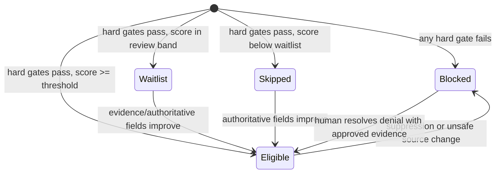
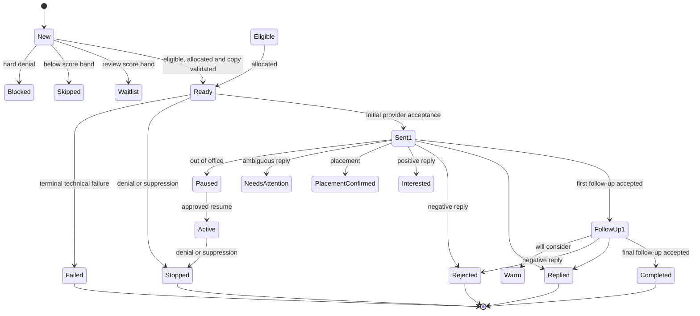
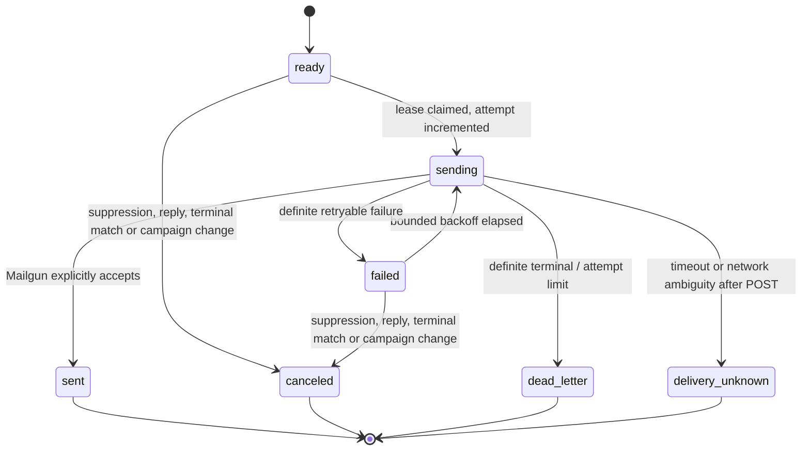
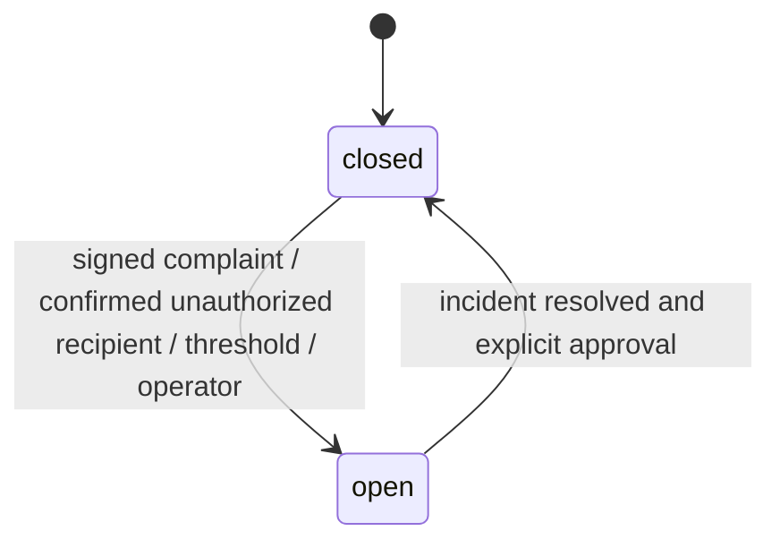

# Outreach state machines and invariants

The system uses separate state machines for business presentation and technical execution. Collapsing them would make a provider timeout indistinguishable from a rejected contact and would make safe recovery impossible.

## Eligibility and allocation

`OutreachMatch.eligibilityStatus` has the exact values `Eligible`, `Waitlist`, `Skipped` and `Blocked`. It is the business-visible result. Matching is deterministic: genre, format, language, territory, explicit-submission evidence, validation recency, previous replies and previous rejection are versioned scoring inputs. A high score never overrides a hard gate.

Allocation then enforces:

- one active sequence per contact;
- no resend of the same release/contact pair;
- an atomic maximum of one active first-email allocation per outlet;
- a PostgreSQL-fenced 14-day outlet first-email cooldown, rechecked immediately before provider dispatch;
- deterministic score, release-priority and release-ID ordering.

## Campaign presentation

EspoCRM uses the labels `New`, `Active`, `Eligible`, `Ready`, `Waitlist`, `Skipped`, `Blocked`, `Sent 1`, `Follow-Up 1`, `Follow-Up 2`, `Completed`, `Replied`, `Rejected`, `Unsubscribed`, `Stopped`, `Placement Confirmed`, `Needs Attention`, `Paused`, `Interested`, `Warm`, `Future Releases` and `Failed`. Technical queue states are not written into this field. `currentSequenceStep` is the integer `0`, `1` or `2`; terminal completion is `campaignStatus=Completed`, not an invented fourth sequence integer. With the default two follow-ups, the worker projects accepted step `2` directly from `Follow-Up 1` to `Completed`; `Follow-Up 2` remains an allowed compatibility/presentation value, not a post-acceptance holding state.

The same versioned transition graph is enforced by an EspoCRM `beforeSave` hook. It rejects unsafe create states, `New → Sent 1` bypasses and every attempt to resume automated delivery from a terminal state even when a caller bypasses the worker. Worker-side validation remains useful for early diagnostics, but it is not the only enforcement boundary.

## Dynamic sequence scheduling

The sequence is a chain of confirmed transitions, not three messages reserved in advance:

| Transition | Durable action | Earliest planned offset |
| --- | --- | --- |
| Eligible allocation | Create allocation, validated copy and queue row for step `0` only | Day `0` |
| Step `0` provider acceptance | Persist acceptance/sequence start, project `Sent 1`, then enqueue work that creates step `1` | Day `+5` from initial acceptance |
| Step `1` provider acceptance | Project `Follow-Up 1`, then enqueue work that creates step `2` | Day `+11` from initial acceptance |
| Step `2` provider acceptance | Project `Completed`, clear `nextActionAt`, release allocation and set cooldown | Acceptance time + configured cooldown (default 21 days) |

Each planned offset is adjusted into Tuesday–Thursday, 09:30–11:30 in the recipient timezone using deterministic jitter. If processing is late, the scheduler chooses the next allowed window rather than sending immediately. `OUTREACH_MAX_FOLLOW_UPS` may reduce the chain; no code path may extend it above two follow-ups.

Any reply, hard or soft bounce, complaint, unsubscribe, manual block, terminal match change or current-policy failure stops/cancels the chain before another message is accepted. There is therefore no legitimate step `1` queue row until step `0` is accepted, and no legitimate step `2` row until step `1` is accepted.

## Send queue

The retry budget is bounded. `delivery_unknown` is intentionally terminal for automation: an operator reconciles deterministic message ID, provider events and Mailgun logs before deciding whether a new business send is safe. Changing it to `failed` to “unstick” the queue risks duplicate email.

## Reply outcomes

| Classification | Match result | Sequence action | Other action |
| --- | --- | --- | --- |
| Unsubscribe | `Unsubscribed` | Stop/cancel | Contact suppression, opt-out evidence. |
| Not Accepting Music | `Needs Attention` | Stop/cancel | Encrypted human-review proposal; no automatic contact/outlet/domain suppression. |
| Hard bounce / complaint | `Stopped` | Stop/cancel | Deny-wins suppression and contact flag. |
| Placement Confirmed | terminal positive | Stop/cancel | Record placement outcome. |
| Interested / Will Consider | positive/warm | Stop/cancel | Human-visible follow-up; only allowlisted automatic response content. |
| Send MP3/WAV / Send Clean Version | interested | Stop/cancel | Reply only with a release URL already stored in EspoCRM. |
| Not Suitable | `Rejected` | Stop/cancel | Preserve genre feedback if explicit. |
| Wrong Person | `Stopped` | Stop/cancel | Human validation required before alternate contact. |
| Out of Office | paused | Move pending time only | Do not count as engagement. |
| Ambiguous | needs attention | Stop/cancel | Encrypted human review; no automatic acknowledgement or invented interpretation. |

Rule order is safety-first: unsubscribe and “not accepting” win even if the same message contains positive language. Only a newly authored explicit contact opt-out is applied irreversibly by automation. Broader outlet/domain actions require an attributable `human_review_items` decision.

## Global safety circuit

Here `closed` means the circuit permits evaluation; `open` blocks capacity reservation. Sending still requires both deployment flags (`kill switch=false`, `send enabled=true`) and all per-recipient gates. The circuit does not auto-close merely because `paused_until` elapsed.

## Cross-state invariants

1. EspoCRM terminal or deny state always cancels non-terminal queue rows.
2. A queue row cannot authorize itself; authoritative entities are fetched again before send.
3. Every release/contact/step is unique, including across worker replicas and retries.
4. Every provider request has one durable attempt and correlation ID.
5. Provider acceptance means “accepted for delivery,” not “delivered” and not “engaged.”
6. Replayed webhook events do not create duplicate work or CRM history.
7. Generated copy is immutable after validation; edits produce a new artifact hash.
8. AI cannot move any state except proposing copy that passes the deterministic validator.
9. GET requests never unsubscribe; mutating opt-out requires a valid token and POST.
10. No operator may requeue uncertain delivery without provider reconciliation evidence.
