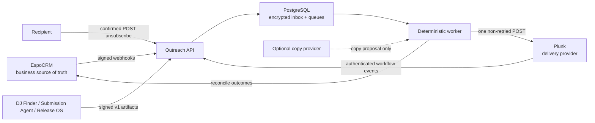

# MarcsMusic outreach worker

Database timeouts, webhook failure/dead-letter state, keyset pagination and fenced reconciliation are defined in [the database and reconciliation safety contract](../../docs/outreach/db-workflow-hardening.md).

The outreach worker is the fail-closed orchestration layer between EspoCRM and
self-hosted Plunk. Plunk delivers through the approved MXRoute SMTP transport;
PostgreSQL owns transient workflow, idempotency and delivery-attempt state.
Legacy Mailgun handling remains only for staged inbound/reconciliation
compatibility until Plunk workflow webhooks are configured. AI, when enabled,
may propose copy only. It cannot select recipients, change eligibility,
override suppressions or send mail.

This service is a production candidate, not evidence of a completed production rollout. Keep sending disabled until the deployment and canary gates in the [Railway runbook](../../docs/outreach/railway-runbook.md) have passed.

The Plunk/MXRoute rollout, DNS, secret rotation and rollback contract is
documented in the [production runbook](../../docs/plunk-mxroute-runbook.md).

## Architecture



The worker is deliberately a modular monolith. The current workload does not justify Redis, a workflow platform or multiple independently deployed microservices. PostgreSQL row leases, `FOR UPDATE SKIP LOCKED`, unique idempotency keys and bounded retries provide the required concurrency controls with a smaller operational surface. Safety events, CRM projections, matching, maintenance and sending use separate bounded claim lanes so an expensive match or reconciliation cannot starve a complaint or opt-out.

## Non-negotiable safety rules

- A send is possible only when `OUTREACH_KILL_SWITCH=false` **and** `OUTREACH_SEND_ENABLED=true`.
- A recipient is reloaded from EspoCRM and re-evaluated immediately before every send.
- Any matching suppression wins over an allow decision.
- Email validation, allowed contact purpose, allowed contact basis, source URL, evidence text, an explicit supported copy language, a supported ISO 3166-1 outlet country, a valid recipient IANA timezone, active outlet, email permission, active campaign window and an EPK/private stream link are hard gates. Missing or unknown locale data is quarantined; it is never guessed as English, UTC or Amsterdam.
- One contact can have only one active sequence. A release/contact/sequence-step has one deterministic idempotency key.
- At most one first email per outlet may be reserved in any 14-day window; PostgreSQL rechecks this atomically immediately before provider dispatch.
- Tuesday–Thursday, 09:30–11:30 in the recipient timezone is the only scheduling window. Follow-ups use the later of the immutable day-5/day-11 sequence offset, the preceding provider acceptance plus exactly four elapsed days, and the current time; deterministic jitter then moves forward to the next valid local slot and never into the past.
- A network timeout after the Plunk POST produces `delivery_unknown`; it is never blindly retried.
- A reply, unsubscribe, hard bounce, complaint or terminal match state cancels remaining messages. A generic `Auto Reply` pauses indefinitely without counting as a response. `Out Of Office` resumes only from one unambiguous explicit return date; missing, ambiguous, invalid or stale dates pause indefinitely and never receive a guessed seven-day resume.
- A signed complaint, or an EspoCRM `Unauthorized Recipient Confirmed` event, opens the durable circuit in the same transaction as ingress and before HTTP acknowledgement.
- EPK verification is a separate default-off one-shot job for `Draft`/`Paused` releases. It checks the live public contract and OCC-writes only four attestation fields; it never changes `status` or activates a release.
- Only an explicit contact opt-out may create an irreversible suppression automatically. Ambiguous and no-submissions replies create encrypted, attributable human-review work; they never auto-reply or block an outlet/domain.
- Daily capacity uses one explicit `Europe/Amsterdam` business date. Reservation finalisation never depends on the PostgreSQL session timezone.
- Shutdown stops new claims immediately, aborts dependency calls and drains/reclassifies leases within a hard 25-second process budget.
- The unsubscribe GET renders a confirmation page. Only POST records the opt-out, preventing link scanners from unsubscribing recipients.
- Logs and metrics must contain identifiers and error codes, not email bodies, addresses, API keys or webhook payloads.

See [source-of-truth ownership](../../docs/outreach/source-of-truth.md) and the [state machine](../../docs/outreach/state-machine.md) for the complete invariants.

## Repository layout

```text
services/outreach-worker/
├── migrations/             PostgreSQL schema; forward-only and additive
├── src/application/        Use-case orchestration
├── src/domain/             Pure policy, scoring and safety rules
├── src/infrastructure/     EspoCRM, Plunk, PostgreSQL, crypto, logging
├── src/interfaces/http/    Signed webhooks, health, metrics, unsubscribe
├── src/jobs/               One-shot operational entry points
└── tests/                  Hermetic node:test regression suite
```

## Local verification

Prerequisites are Node.js 20.12 or newer and a dedicated PostgreSQL database with permission to install `pgcrypto`. Never point local tests at production EspoCRM, Mailgun or PostgreSQL.

```bash
cd services/outreach-worker
npm install
npm run verify
```

`npm run verify` includes the bounded load/chaos contract. It starts a disposable local PostgreSQL cluster, replays 10,000 signed webhooks, drains 2,000 leased work items across 32 workers, terminates a database backend, expires delivery leases, and forces a provider timeout. It performs no external HTTP request and must never use production credentials or data. Run only that contract with `npm run test:load`; its per-scenario budgets keep the complete verification suite well below three minutes on a normal development machine.

The domain and cryptographic tests require no live credentials or network. Database and provider integration tests use disposable local data and require PostgreSQL command-line binaries (`initdb` and `pg_ctl`) on `PATH`.

For a local application run:

```bash
cp .env.example .env
openssl rand -base64 32
openssl rand -hex 32
npm run db:migrate
npm start
```

Store generated values only in the local `.env` or the deployment secret store; do not paste them into tickets, logs, shell history or this repository. The base64 output is for `OUTREACH_DATA_ENCRYPTION_KEY`; independent random values are required for hashing, unsubscribe signing, webhook signing and provider credentials.

`OUTREACH_PROCESS_MODE=all` runs API and workers together. `api` and `worker` modes allow later horizontal isolation without changing domain code. Production starts in `all` mode unless measured load or fault isolation justifies separate deployments.

## HTTP surface

| Route | Authentication | Purpose |
| --- | --- | --- |
| `GET /livez` | none | Process liveness only. |
| `GET /readyz` | none | Durable PostgreSQL ingress and local schema readiness only. |
| `GET /capabilities` | none | Sanitized CRM/workflow and durable-observability capabilities, including explicit external alert-router/dashboard gates, plus separate provider health. |
| `GET /metrics` | bearer `METRICS_TOKEN` | Prometheus text metrics; never expose publicly without access control. |
| `POST /webhooks/espocrm/:event` | EspoCRM webhook HMAC | Encrypted, replay-safe CRM event ingestion. |
| `POST /webhooks/plunk` | Plunk workflow Bearer secret | Encrypted, replay-safe delivery/reply ingestion. |
| `POST /webhooks/mailgun` | Legacy Mailgun timestamp/token HMAC | Compatibility ingestion only. |
| `GET /unsubscribe?token=…` | signed token | Non-mutating confirmation page. |
| `POST /unsubscribe` | signed token | Deny-wins suppression and sequence cancellation. |
| `POST /api/v1/source-ingestion/:sourceId` | source-specific HMAC + timestamp + nonce | Idempotent, evidence-bearing discovery/release ingestion. |

Webhook bodies are limited to 1 MiB. EspoCRM, Plunk and webhook requests use
bounded JSON payloads; legacy Mailgun may use its supported form or multipart
format, but file parts are rejected.

## Configuration groups

- `DATABASE_*`: dedicated technical-state PostgreSQL; never reuse the EspoCRM database.
- `HTTP_MAX_IN_FLIGHT_REQUESTS`: per-replica admission bound for every route except `/livez`; overflow receives retryable `429`, while readiness and capability checks are single-flight cached for five seconds.
- `ESPOCRM_*`: least-privilege API identity and a versioned map of webhook IDs to secrets.
- `PROVIDER_CAPABILITY_CACHE_TTL_MS`: bounded 1–300 second cache with single-flight request coalescing for external capability probes.
- `PLUNK_*`: self-hosted API origin, fixed sender, API secret and workflow webhook secret. These are the only outbound provider settings.
- `MAILGUN_*`: legacy inbound/reconciliation compatibility only; never an outbound send path.
- `OUTREACH_KILL_SWITCH` and `OUTREACH_SEND_ENABLED`: independent fail-closed controls.
- `OUTREACH_*_LIMIT`, thresholds and cooldowns: deterministic policy controls.
- `OUTREACH_OUTCOME_RECONCILE_*`: default-off missed-webhook recovery with one fenced PostgreSQL owner, a fixed upper watermark, an exact five-minute overlap, bounded page/backlog/response limits, and crash-resumable `(timestamp,id)` plus opaque-token checkpoints. Mailgun Logs is the default; deprecated Events is explicit compatibility mode only.
- `OUTREACH_*_CONCURRENCY`, `DATABASE_POOL_MAX`: bounded priority lanes; startup reserves two database connections for ingress/control-plane work, or three when durable observability is enabled.
- `OUTREACH_OBSERVABILITY_*`, `OUTREACH_ALERT_PROJECTOR_*`: independently approved policy/runtime cadence, explicit headroom, bounded prune and transactional alert-outbox projection. The external alert router and dashboard are intentionally unconfigured; see `docs/durable-observability.md`.
- `OUTREACH_SHUTDOWN_TIMEOUT_MS`: hard maximum of 25 seconds, below Railway's termination window.
- `OUTREACH_DATA_*`, `OUTREACH_HASH_KEY`, `OUTREACH_UNSUBSCRIBE_KEYRING_JSON`: separate cryptographic purposes; do not reuse keys. The hash key and `OUTREACH_HASH_KEY_EPOCH` are immutably attested in PostgreSQL after migration 018; this release refuses drift and does not implement hash-key rotation. Unsubscribe v2 has one active signing key and at most five verify-only historical keys; legacy v1 is disabled unless an independent key and explicit cutoff are both configured.
- `COPY_PROVIDER_*`: optional structured copy provider. Disabled is a supported production mode.
- `COPY_LINK_CHECK_*`: mandatory bounded reachability gate for the chosen EPK/private-stream URL before a copy artifact is persisted.
- `EPK_VERIFIER_*`: default-off, allowlist-only public EPK verification with one total deadline and strict redirect/header/body/asset/batch bounds.
- `SOURCE_INGESTION_*`: explicit source allow-list, independent HMAC keys, replay window and artifact-age bound.
- `EMAIL_VALIDATION_PROVIDER_*`: bounded validation contract. Production may use
  `EMAIL_VALIDATION_PROVIDER_TYPE=mailgun`, which reuses the official
  `MAILGUN_VALIDATION_API_KEY`, `MAILGUN_BASE_URL` and `MAILGUN_DOMAIN` secrets
  and calls Mailgun's read-only address-validation endpoint. The validation key
  must have Mailgun Email Validation permission; the legacy sending/webhook key
  is intentionally not reused. HTTP and SMTP remain explicit alternatives;
  disabled or unproven health is reported fail-closed.
- `OUTREACH_RETENTION_POLICY_JSON`, `OUTREACH_PRIVACY_*_CONFIRM`: default-disabled, owner-approved privacy policy and explicit one-shot execution gates; see the privacy runbook.
- `METRICS_TOKEN`: bearer token for operational metrics.

Startup validates the complete configuration and exits on missing or malformed values. This is intentional: partially configured outreach must not run.

`/readyz` never calls Mailgun, EspoCRM, an email-validation provider, alert router or dashboard. It reports only the local startup contract required to durably accept work: PostgreSQL connectivity and the worker schema. External dependency loss therefore cannot cause Railway to restart a replica that can still accept signed webhooks. `/capabilities` reports those dependencies separately and remains `degraded` while the required external alert-router/dashboard gates are unconfigured, even when `/readyz` is ready. Its observability normalizer exposes only fixed booleans, the fixed `external` mode and allowlisted reason codes; policy references, digests, cursors, backlog counts, endpoints and credentials are never public.

The Mailgun capability adapter performs only `GET /v4/domains/{configured-domain}` with a strict timeout and response-byte cap. It requires an active, non-disabled, exactly matching domain and returns only allowlisted reason codes; provider bodies and credentials are never returned. Its response does not prove that inbound routes exist. `MAILGUN_INBOUND_ROUTE_EVIDENCE=configured` is accepted only with an opaque non-secret evidence reference to an operator-archived live route test; otherwise `/capabilities` reports the route as `unknown`.

Outcome reconciliation never sends mail and never bypasses either webhook signature path. The Mailgun Logs request is server-filtered to the exact configured domain and `marcsmusic-outreach` tag, then client-filtered again before any payload reaches the existing encrypted event inbox. Only events bound to a known deterministic/provider message identity are accepted. A `stored` inbound reply is retrieved only when live inbound-route evidence is configured; its storage URL must use an allowlisted Mailgun storage host and the exact configured domain/message path, with redirects, credentials, query strings, oversized bodies and path drift rejected. If this provider capability is unavailable, polling explicitly incoming Espo `Email.created` records is required and `/capabilities` reports that recovery mode instead. Provider paging tokens, cursors and counters contain no recipient, subject, body or URL data.

`npm run run:reconcile-outcomes` executes one bounded recovery invocation. The normal worker schedules the same `run_outcome_reconcile` maintenance item. Page-budget or queue-backpressure exhaustion is retryable and resumes the durable checkpoint; it does not advance the watermark. Accepted provider evidence may resolve `delivery_unknown` only through a second transactional identity fence. Direct Mailgun replies are projected idempotently as managed Espo Emails with `inbound:<sha256>` identity and explicit `Received` status before deterministic classification.

Email validation health is equally explicit. A configured HTTP validator is live-probed only when `EMAIL_VALIDATION_PROVIDER_HEALTH_URL` names a dedicated, non-mutating `GET` endpoint returning JSON `{"status":"ok"}`. SMTP/MX validation reports only bounded MX health. Mailgun validation reuses the already-cached non-mutating Mailgun domain GET for control-plane health; it never calls the billable address-validation endpoint as a capability probe. No capability check validates a recipient or consumes a send operation.

The copy gate accepts only HTTPS on port 443. It rejects credentials and any DNS answer or redirect hop that is loopback, link-local, private, multicast, documentation, reserved, or otherwise non-public. TLS uses the original hostname while the socket is pinned to the address that was validated, preventing a second DNS lookup from bypassing the policy. Redirects, total duration, and response-header bytes are bounded; `HEAD` falls back to a bodyless ranged `GET` only when the origin reports that `HEAD` is unsupported. HTTP `408`, `429`, `5xx`, network errors, and timeouts remain retryable; other `4xx` responses are permanent. The tokenized unsubscribe URL is deliberately not probed: readiness of `OUTREACH_PUBLIC_BASE_URL` is an operational deployment responsibility and probing recipient-specific tokens would leak or consume them.

## Existing source integration

The worker does not scrape or mount another service's data volume. It accepts one strict `1.0` artifact contract from exactly three identities: `dj-finder`, `music-submission-agent`, and `marcsmusic-release-os`. Each producer sends the exact JSON bytes to `POST /api/v1/source-ingestion/:sourceId` with:

- `x-source-timestamp`: current Unix time in seconds;
- `x-source-nonce`: a fresh 16–128 character nonce for every attempt;
- `x-source-key-id`: the producer's active 1–32 character key identifier;
- `x-source-signature`: `v2=` plus HMAC-SHA256 over `v2\n<sourceId>\n<keyId>\n<timestamp>\n<nonce>\n<SHA256(exact-body)>`;
- `content-type: application/json`.

PostgreSQL rejects nonce replay, artifact-ID/content collisions and concurrent processing. Completed artifacts return their stored count result without repeating validation or CRM writes. Records are normalized into `MediaOutlet`, `MediaContact`, and `MusicRelease`. Finite privacy-hashed identity claims serialize outlet domain and contact email/composite fingerprint, Instagram, normalized name+outlet and show+outlet matches. Conflicting unique signals fail closed; strictly newer verified evidence may merge, while block/opt-out/bounce/suppression state is deny-wins. Releases require a valid ISRC and enter EspoCRM as `Draft`, never `Active`.

Source and evidence URL, text, and capture timestamp are mandatory. Source URLs are canonicalized before semantic digests and CRM projection: only known tracking parameters are removed and functional query parameters remain. Outlet `subGenres` and `formatGenres`, plus release `subGenres` and ISO alpha-2 `territories`, are independent bounded fields; `formatGenres` is never inferred from main `genres`. Missing or `Other`/unknown language, territory, format, or subgenre values earn zero match points. Even main-genre overlap plus explicit submission and current validation scores only 45, below the default auto-send threshold of 80. DJ Finder may export only explicit music-submission, press, or promotional addresses; booking and management addresses do not become contacts. Music Submission Agent currently contributes outlet/submission-route evidence, not recipient addresses. See [the v1 artifact/v2 authentication producer contract](docs/source-ingestion-v1.md) for exact mappings and Railway variables.

The validation adapter always emits the strict JSON contract `{ "status": "Valid|Invalid|Risky|Unknown", "checkedAt": "ISO timestamp", "providerReference": "..." }`. For Mailgun, only `result=deliverable`, `risk=low`, and non-role/non-disposable responses become `Valid`; `undeliverable`/`do_not_send` become `Invalid`; catch-all, medium/high risk and disposable/role addresses remain `Risky`. Only exact `Valid` creates `Ready for Matching`. `Risky`, `Invalid`, and `Unknown` are explicitly marked `never_use`; provider-disabled, timeout, malformed and future/unknown statuses also fail closed and never become an eligibility allow decision.

Historical contacts imported from Mailgun are intentionally quarantined. To
refresh only their technical address status, queue the explicit
`run_mailgun_validation_reconcile` maintenance work item once after checking
the pending-work queue. It scans `MediaContact` records and enqueues
`validate_contact_email`; that handler updates `emailValidationStatus` and
`lastValidatedAt`, and marks every non-`Valid` result `doNotContact=true`.
An exact `Valid` result may clear only the import/validation quarantine; it
never clears an explicit `Blocked` state, opt-out or hard-bounce, and never
bypasses consent, purpose, basis, evidence or campaign gates. A Mailgun `Valid` result
is therefore a necessary technical prerequisite, not permission to contact a
person. Outreach requires the existing CRM consent/evidence policy to pass as
well.

## Data handling

Webhook payloads, generated copy and automatic-response payloads are encrypted with AES-256-GCM and associated data. Suppression lookups use keyed HMAC hashes. Raw contact data remains in EspoCRM. A content hash or suppression hash is pseudonymous data, not anonymous data, and remains within privacy scope.

Changing `OUTREACH_DATA_ENCRYPTION_KEY` without retaining the old version in `OUTREACH_DATA_DECRYPTION_KEYS_JSON` will make stored rows unreadable. Rotation uses one active encrypt key and a bounded decrypt-only historical keyring. Preview with `npm run crypto:reencrypt`; applying requires both send locks, the exact `OUTREACH_DATA_REENCRYPT_CONFIRM=reviewed-bounded-data-key-rotation` confirmation and explicit `-- --apply`. Re-run bounded batches until every table reports only the active version, verify restore/read paths, then remove an old key through a separate reviewed change. A direct environment-variable replacement is never a valid rotation procedure.

Retention, legal holds and DSAR planning are implemented as separate fail-closed one-shot jobs. They use an exact nine-class versioned policy, online concurrent indexes, bounded UUID backfill/finalization, digest-bound plans, subject-scoped legal holds, crypto-tombstones and encrypted artifacts. No retention period is supplied by the application, and no live EspoCRM DSAR mutation executor exists in this worker. Use the [privacy governance runbook](docs/privacy-governance.md) before operating these controls.

## Operations and governance

- [Requirements traceability and current production gates](../../docs/outreach/requirements-traceability.md)
- [Railway deployment, incident and rollback runbook](../../docs/outreach/railway-runbook.md)
- [Legacy Lead migration](../../docs/outreach/legacy-lead-migration.md)
- [Privacy governance, retention, legal holds and DSAR](docs/privacy-governance.md)
- [EPK verification and activation evidence](docs/epk-verifier.md)
- [Signing-key rotation and rollback](../../docs/outreach/key-rotation.md)
- [ISO 27001/27701 evidence limitations](../../docs/outreach/compliance-evidence.md)

Repository controls demonstrate design intent. They do not prove lawful-basis approval, vendor governance, access reviews, backup restoration, incident exercises, control operation or ISO certification.
